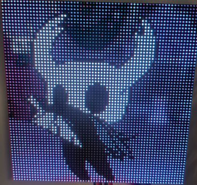
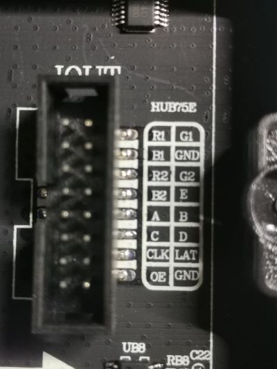
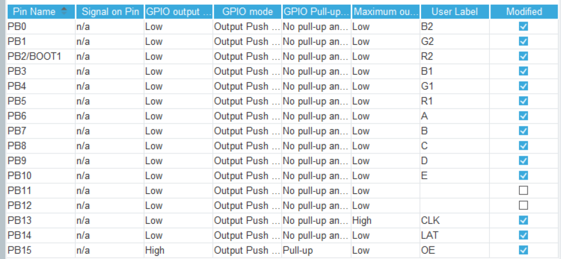
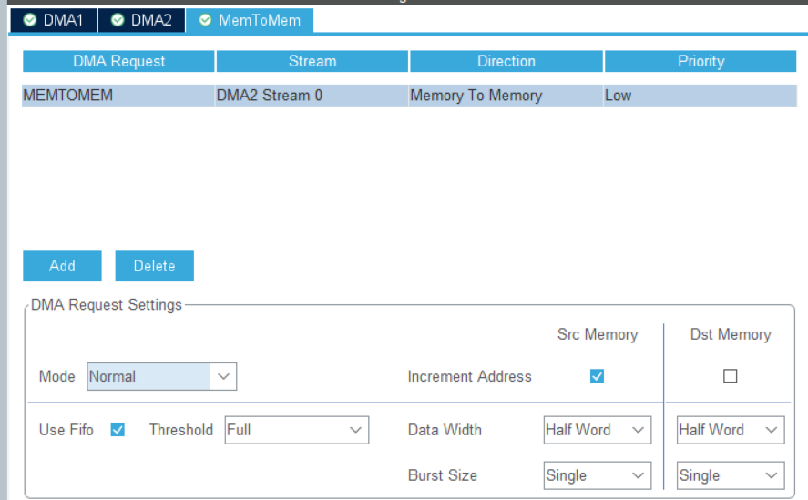
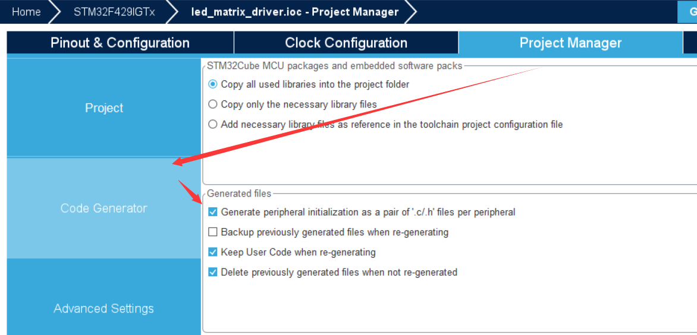
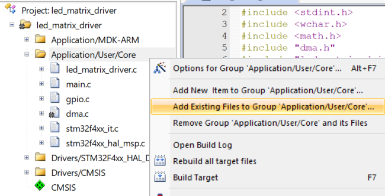
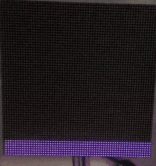

# STM32 LED Matrix Driver using DMA
This project is a CubeMX project that utilizes STM32’s DMA to automatically flip parallel GPIO ports in order to drive an LED matrix panel.


## Preparation
You will need
- an LED screen with a HUB75E interface
  - currently only supports a size of 64x64
- a stm32f429 development board
  - all PB ports as output
  - at least 60kB of memory
  - CubeMX and Keil development environments

## Setup
### 0. LED Matrix Panel Wiring
Firstly, make sure your panel has HUB75E interface as shown following.



connect them to your development board as shown following. PB12 & PB11 are not used. Notice that there are two hub75e interfaces on board, one is **IN** and the other is **OUT**. You should connect your PB pins to the **IN** hub75e interface.
```c
/**
*      PB 15 14  13  12 11 10 9 8 7 6 5  4  3  2  1  0
*         OE LAT CLK  ?  ?  e d c b a r1 g1 b1 r2 g2 b2
*/
```
### 1. CubeMX Configuration
Firstly, configure your PB ports as shown following.



Then, enable DMA memtomem as shown following. Notice "Increment Address" of "Dst Memory" is **unchecked**.



Next, at Project Manager > Code Generator, **check** the option "Generate peripheral initialization as a pair of .c/.h per peripheral"



Finally, choose "MDK-ARM" to generate a keil project and open it.
### 2. Keil Setup
Copy this project's [Core/Src/led_matrix_driver.c](Core/Src/led_matrix_driver.c) & [Core/Inc/led_matrix_driver.h](Core/Inc/led_matrix_driver.h) into your folders. Add the .c file into your Keil's Application/User/Core as shown following.



Then open your main.c and edit main function like this:
```c
int main(void)
{
  /* USER CODE BEGIN 1 */

  /* USER CODE END 1 */

  /* MCU Configuration--------------------------------------------------------*/

  /* Reset of all peripherals, Initializes the Flash interface and the Systick. */
  HAL_Init();

  /* USER CODE BEGIN Init */

  /* USER CODE END Init */

  /* Configure the system clock */
  SystemClock_Config();

  /* USER CODE BEGIN SysInit */

  /* USER CODE END SysInit */

  /* Initialize all configured peripherals */
  MX_GPIO_Init();
  MX_DMA_Init();
  /* USER CODE BEGIN 2 */
  init_driver(0, 1, &hdma_memtomem_dma2_stream0);

  /* USER CODE END 2 */

  /* Infinite loop */
  /* USER CODE BEGIN WHILE */
  uint32_t last, now;
  int cnt = 0;
  last = HAL_GetTick();
  while (1)
  {
    clear_frame();
    ++cnt;
    if (cnt > 63) {
      cnt = 0;
    }
    for (int i = 0; i <= cnt; ++i) {
      draw_line(0, i, 63, i, to_rgb565(128, i*4, 128));
    }
    present_frame();
    HAL_Delay(100);
    /* USER CODE END WHILE */

    /* USER CODE BEGIN 3 */
  }
  /* USER CODE END 3 */
}
```
compile & flash to your device!
### 4. Result
flash above main code and you should see your panel output colorful lines like this:



## TODO
 - purpose of this project
 - difference from other projects
 - better code
 - more examples
 - font & text rendering
 - reduce ram usage(possibly cannot)